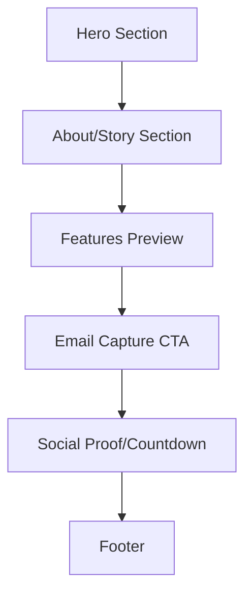

# ArtVendor Website Rebuild Plan

## Brand Analysis

### Artwork Analysis
The provided artwork is a stunning pointillist portrait that reveals deeper meaning upon inspection:

**Visual Elements:**
- **Style**: Pointillism/mosaic technique - thousands of tiny colored dots forming a larger portrait
- **Subject**: A woman's face emerging from a crowd of colorful figures
- **Color Palette**: Vibrant and diverse
  - Primary Reds: #E63946, #FF6B6B
  - Deep Blues: #1D3557, #457B9D
  - Warm Yellows: #F4A261, #E9C46A
  - Rich Purples: #7B2CBF, #9D4EDD
  - Clean Whites: #F1FAEE, #FFFFFF
  - Accent Oranges: #F77F00, #FCBF49

**Symbolic Meaning:**
- Individual people coming together to create something beautiful
- Community-driven art platform
- Diversity and inclusion in art
- The collective creating the extraordinary

### Current Website Issues
- Generic dark blue gradient doesn't reflect the vibrant artwork
- No visual connection to the brand's artistic identity
- Missing the artwork as a hero element
- Basic email form without compelling copy
- No countdown or launch date indication
- Social links are placeholder text only

---

## Unified Brand Identity

### Brand Name
**ArtVendor** (stylized as **ARTVENDOOR** based on PDF filename)

### Brand Positioning
"Where Art Meets Community" - A platform that connects artists and art lovers, built on the belief that great art emerges from diverse voices coming together.

### Color System

| Role | Color | Hex Code | Usage |
|------|-------|----------|-------|
| Primary | Vibrant Red | #E63946 | CTAs, accents, highlights |
| Secondary | Deep Blue | #1D3557 | Headers, dark backgrounds |
| Accent 1 | Warm Yellow | #F4A261 | Secondary buttons, badges |
| Accent 2 | Rich Purple | #7B2CBF | Creative elements, hover states |
| Neutral Light | Off White | #F1FAEE | Backgrounds, cards |
| Neutral Dark | Charcoal | #2B2D42 | Body text |
| Success | Emerald | #2A9D8F | Confirmations, success states |

### Typography

| Element | Font | Weight | Usage |
|---------|------|--------|-------|
| Headings | Playfair Display | 700/400 | Hero text, section titles |
| Body | Inter | 400/500/600 | Paragraphs, UI text |
| Accent | Space Grotesk | 500/700 | Tags, labels, small text |

### Visual Language
- **Texture**: Subtle dot patterns referencing pointillism
- **Shapes**: Organic, flowing forms mixed with clean geometric elements
- **Imagery**: Artwork-forward, letting art speak for itself
- **Motion**: Smooth, elegant transitions that feel artistic

---

## New Landing Page Structure

### Wireframe Overview



### Section Breakdown

#### 1. Hero Section
- **Background**: Full-bleed artwork with subtle dark overlay
- **Content**:
  - Logo (ARTVENDOOR) with custom wordmark
  - Tagline: "Where Every Voice Creates Masterpieces"
  - Subheadline: "A new kind of art marketplace is coming"
  - Email capture form (primary CTA)
  - "Launching Soon" badge with countdown timer

#### 2. Story Section
- **Layout**: Two-column (text + visual element)
- **Content**:
  - "Art Belongs to Everyone"
  - Brief story about the platform's mission
  - Dot-pattern visual element referencing the artwork style

#### 3. Features Preview
- **Layout**: Three cards in a row
- **Cards**:
  1. "Discover Unique Art" - Icon + description
  2. "Support Independent Artists" - Icon + description
  3. "Join a Creative Community" - Icon + description

#### 4. Email Capture Section
- **Background**: Gradient using brand colors
- **Content**:
  - "Be the First to Know"
  - Email form with compelling copy
  - Privacy assurance text

#### 5. Social Proof / Countdown
- **Elements**:
  - Countdown timer to launch
  - Social media links with icons
  - "Join X people waiting" counter

#### 6. Footer
- Logo
- Copyright
- Privacy policy link
- Social links

---

## File Structure

```
artvendor/
├── index.html              # Main landing page
├── assets/
│   ├── css/
│   │   └── styles.css      # Main stylesheet
│   ├── js/
│   │   └── main.js         # Interactions, countdown, form handling
│   ├── images/
│   │   ├── hero-artwork.jpg    # Main artwork (optimized)
│   │   ├── logo.svg            # Custom logo
│   │   └── patterns/           # Dot pattern SVGs
│   └── fonts/
│       └── (Google Fonts loaded via CDN)
├── plans/
│   └── ARTVENDOR_REBUILD_PLAN.md
└── DEPLOYMENT_GUIDE.md
```

---

## Email Sequence Integration

Based on typical pre-launch email sequences, the landing page should:

1. **Capture emails** with clear value proposition
2. **Set expectations** about what subscribers will receive
3. **Connect to email service** (Mailchimp, ConvertKit, etc.)
4. **Include double opt-in** confirmation page

### Recommended Email Sequence Structure
*(To be confirmed with PDF content)*

| Email # | Timing | Purpose |
|---------|--------|---------|
| 1 | Immediate | Welcome + brand story |
| 2 | Day 3 | Behind the scenes / mission |
| 3 | Day 7 | Artist spotlight / community |
| 4 | Day 14 | Feature preview |
| 5 | Day 21 | Early access invitation |
| 6 | Day 28 | Launch announcement |

---

## Technical Implementation

### Technologies
- **HTML5** - Semantic markup
- **CSS3** - Custom properties, Grid, Flexbox, animations
- **Vanilla JavaScript** - No framework needed for landing page
- **Email Service** - Mailchimp/ConvertKit embed or API
- **Hosting** - Cloudflare Pages (as per deployment guide)

### Performance Goals
- Lighthouse score: 95+
- First Contentful Paint: < 1.5s
- Largest Contentful Paint: < 2.5s
- Cumulative Layout Shift: 0

### Accessibility
- WCAG 2.1 AA compliant
- Proper contrast ratios
- Keyboard navigation
- Screen reader support
- Alt text for all images

---

## Implementation Steps

1. **Setup**
   - Create file structure
   - Set up CSS custom properties with brand colors
   - Configure Google Fonts

2. **Hero Section**
   - Implement full-bleed artwork background
   - Add overlay and content
   - Build email capture form

3. **Content Sections**
   - Story section with typography
   - Feature cards with icons
   - Countdown timer component

4. **Interactions**
   - Smooth scroll behavior
   - Form validation
   - Countdown timer logic
   - Animation on scroll

5. **Polish**
   - Responsive design (mobile-first)
   - Performance optimization
   - Accessibility audit
   - Cross-browser testing

6. **Integration**
   - Connect email service
   - Add analytics
   - Set up social links

---

## Questions for Clarification

1. **Email Sequence Content**: What specific messaging is in the PDF? This will help align the landing page copy.

2. **Launch Date**: Is there a specific launch date for the countdown?

3. **Email Service**: Which email marketing platform will be used?

4. **Social Links**: What are the actual social media URLs?

5. **Additional Pages**: Will there be additional pages (About, Privacy, etc.) or just the landing page for now?

6. **Logo**: Is there an existing logo file, or should one be created based on the brand identity?

---

## Next Steps

1. Review and approve this plan
2. Provide answers to clarification questions
3. Switch to Code mode for implementation
4. Deploy to Cloudflare Pages
